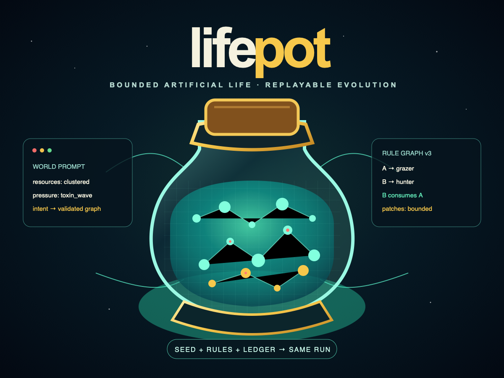
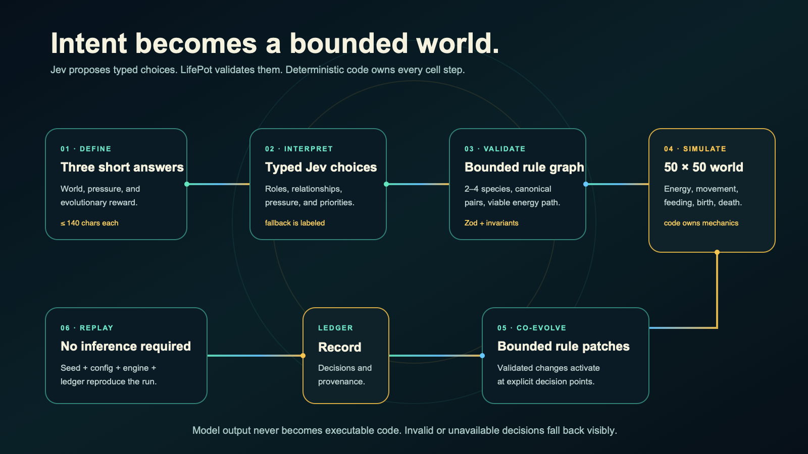

# LifePot

<p align="center">
  
</p>

<p align="center"><strong>Describe a world. Let Jev propose its ecology. Watch deterministic life adapt inside explicit boundaries.</strong></p>

<p align="center">
  LifePot is a replayable 50 × 50 artificial-life laboratory where model decisions become validated ecosystem rules—not executable code.
</p>

<p align="center">
  <a href="https://github.com/tugrulguner/lifepot/actions/workflows/ci.yml"></a>
  <a href="https://discord.gg/u3AANZr6RG"></a>
  <a href="LICENSE"></a>
  <a href="https://github.com/tugrulguner/lifepot"></a>
</p>

<p align="center">
  <a href="#why-lifepot">Why LifePot</a> ·
  <a href="#try-it-locally">Quick start</a> ·
  <a href="#what-ships-today">What ships</a> ·
  <a href="#how-it-works">How it works</a> ·
  <a href="#documentation">Docs</a> ·
  <a href="#community-and-contributing">Contribute</a>
</p>

<p align="center">
  
</p>

## Why LifePot

Most generative simulations either hard-code every world or let model prose quietly become behavior. LifePot separates the two:

- **Jev proposes** typed species roles, relationships, environmental conditions, strategies, and bounded rule changes.
- **LifePot validates** every proposal against finite schemas and ecosystem invariants.
- **Deterministic code executes** movement, feeding, resources, hazards, reproduction, mutation, death, and rule activation.
- **The ledger preserves** the decisions needed to inspect and replay a run without inference.

A world is not an arbitrary script. It is a validated graph:

```ts
{
  species: [
    { id: "A", role: "grazer", selfInteraction: "cooperative" },
    { id: "B", role: "hunter", selfInteraction: "territorial" },
  ],
  interactions: [{ pair: "A:B", mode: "b_consumes_a" }],
  environment: {
    regeneration: "steady",
    pressure: "stability",
    volatility: "stable",
    intensity: "medium",
    duration: "persistent",
  },
}
```

## Try it locally

LifePot works without credentials through a labeled deterministic fallback. Add a TypeSafe API key to exercise live Jev interpretation.

```bash
git clone https://github.com/tugrulguner/lifepot.git
cd lifepot
npm ci
cp .env.example .env.local  # optional: add TYPESAFE_API_KEY
npm run dev -- --hostname 127.0.0.1
```

Open `http://127.0.0.1:3000`, answer three prompts, review the validated world, and seed the ecosystem.

## What ships today

- A deterministic, toroidal **50 × 50** cellular world that runs for at most **180 generations**.
- Two to four rule species with canonical pair relationships and an explicit basal-energy viability check.
- Energy, resources, hazards, movement, trophic feeding, reproduction, death, lineages, strategies, and five bounded heritable traits.
- Triggered ecological decisions for prey crashes, predator crashes, resource shifts, speciation, predation spikes, and stagnation.
- Validated scheduled changes with explicit activation, duration, transition, and graph-version bindings.
- A deterministic fallback for absent credentials, invalid responses, network failures, and exhausted limits.
- Versioned replay data bound to the setup request, engine version, configuration, seed, decision ledger, and contract hash.
- Unit, API/security, rule-engine, replay, and browser acceptance coverage.

## How it works

### 1. Define the world

`POST /api/judge` accepts exactly three trimmed strings of at most 140 characters:

1. What exists in this world?
2. What threatens life here or how does it change?
3. What should life be rewarded for?

The request includes a canonical setup hash. Text remains data; it never becomes executable rules.

### 2. Interpret and validate

Jev answers typed Choice and Score questions. LifePot accepts only enumerated roles, interactions, environmental laws, strategies, mutation settings, and transition controls. Zod schemas and additional graph invariants reject incomplete, noncanonical, or unviable configurations.

### 3. Simulate in code

The seeded engine owns every cell step. It uses typed arrays for world state and applies graph relationships mechanically. A species label does not create feeding behavior; only the validated directed relationship does.

### 4. Co-evolve at bounded triggers

After generation 12, LifePot can pause on a canonical ecological trigger. Decisions have a 12-generation cooldown and the ledger is capped at eight entries. A candidate decision must match the frozen observation hash, generation, trigger, and current rule-graph version before it can affect the run.

### 5. Replay without inference

Replay validates the complete contract before executing. The same accepted seed, setup, configuration, engine version, and ordered ledger reproduce the run without calling Jev. Modified, reordered, unreachable, or incomplete decisions are rejected.

## Boundaries

LifePot is an artificial-life toy, not a biological forecast.

- Only the enumerated roles, relationships, pressures, strategies, and transitions exist.
- Model confidence is evidence about a typed choice, not proof of ecological truth.
- Mutation settings influence bounded mechanics; they do not imply foresight or beneficial evolution.
- Extinction is a valid result. Fallback behavior is labeled rather than presented as model output.
- Replay provides deterministic reproduction of this engine contract, not a scientific guarantee about nature.

Read [the simulation contract](docs/simulation-contract.md) for the exact boundary and [the architecture guide](docs/architecture.md) for ownership across the system.

## Documentation

| Guide | Purpose |
| --- | --- |
| [Architecture](docs/architecture.md) | Request flow, module boundaries, validation, runtime, and replay |
| [Simulation contract](docs/simulation-contract.md) | Determinism, bounded semantics, guarantees, and non-guarantees |
| [Deployment](docs/deployment.md) | Environment variables, distributed limits, and production checks |
| [Reviewing](docs/reviewing.md) | Correctness and safety checklist for changes |
| [Roadmap](ROADMAP.md) | Direction without presenting planned work as shipped |
| [Contributing](CONTRIBUTING.md) | Setup, quality gates, and contribution scopes |

## Development

```bash
npm test
npm run lint
npm run typecheck
npm run build
npx playwright install chromium
npm run test:e2e
```

The normal suite uses controlled fixtures. Passing fixtures validates contracts and orchestration, not live-model quality.

## Community and contributing

Use [GitHub Issues](https://github.com/tugrulguner/lifepot/issues) for reproducible bugs and scoped proposals. Use the permanent [ModePot Discord](https://discord.gg/u3AANZr6RG) for exploratory discussion and implementation questions.

Before opening a change, read [CONTRIBUTING.md](CONTRIBUTING.md). Substantial simulation-contract or model-authority changes should be discussed before implementation.

## ModePot family

LifePot is part of the [ModePot](https://github.com/tugrulguner/modepot) family alongside [Intpot](https://github.com/tugrulguner/intpot), [Summonpot](https://github.com/tugrulguner/summonpot), and [Dexpot](https://github.com/tugrulguner/dexpot).

## License

[MIT](LICENSE)
